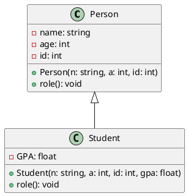

To generate a UML diagram directly from code, you can use a variety of tools that parse the code and create UML diagrams automatically. Below are some methods and tools you can use to generate UML diagrams from your C++ code:

### 1. **Using Doxygen with Graphviz**

**Doxygen** is a popular tool for generating documentation from annotated C++ code. It can also generate UML diagrams when combined with **Graphviz**, which provides graph visualization. Here's how you can use them:

#### Steps:
1. **Install Doxygen**: 
   - Download and install Doxygen from [https://www.doxygen.nl/](https://www.doxygen.nl/).
   
2. **Install Graphviz**: 
   - Download and install Graphviz from [https://graphviz.gitlab.io/download/](https://graphviz.gitlab.io/download/).

3. **Create a Doxygen Configuration File**:
   - Run `doxygen -g` in your terminal to generate a default `Doxyfile`.

4. **Edit the Doxyfile**:
   - Open the `Doxyfile` in a text editor and enable UML diagram generation by setting the following options:
   
     ```
     HAVE_DOT = YES           # Enable Graphviz to generate UML diagrams
     EXTRACT_ALL = YES        # Extract all documentation
     ```

   - You can also specify the output format (e.g., HTML or LaTeX):
   
     ```
     OUTPUT_DIRECTORY = docs  # Where the documentation will be saved
     GENERATE_LATEX = YES     # Optionally generate LaTeX for PDF output
     GENERATE_HTML = YES      # Generate HTML files
     ```

5. **Generate Documentation**:
   - Run the command `doxygen Doxyfile` to generate the documentation.
   - Doxygen will parse your code and generate UML diagrams for the classes and their relationships.
   - The UML diagrams will be included in the generated HTML documentation under the `docs/` directory.

#### Example Command:
```bash
doxygen Doxyfile
```

This will generate an HTML folder containing the documentation, including UML class diagrams.

---

### 2. **Using Visual Studio with UML Class Diagram**

If you're using **Visual Studio**, it provides a feature to generate UML diagrams directly from your C++ code using its built-in **Architecture** tools.

#### Steps:
1. **Open Your Project in Visual Studio**.
2. **Enable the Architecture Tools**:
   - Go to `Tools` → `Options`.
   - Under `Architecture`, enable the UML support.

3. **Generate UML Diagrams**:
   - Right-click on the solution or project in **Solution Explorer**.
   - Select `View` → `Architecture` → `New UML Class Diagram`.
   - Visual Studio will generate a class diagram based on your code.

Note: UML diagrams are available in Visual Studio Professional and Enterprise editions.

---

### 3. **Using StarUML**

**StarUML** is a powerful UML tool that allows you to manually create UML diagrams or reverse engineer C++ code into UML diagrams.

#### Steps:
1. **Download and Install StarUML**:
   - You can download StarUML from [https://staruml.io/](https://staruml.io/).

2. **Reverse Engineer C++ Code**:
   - Open StarUML and create a new project.
   - Select `File` → `Import` → `Reverse Engineer` and select your C++ project.
   - StarUML will parse your C++ code and generate the corresponding UML diagrams.

---

### 4. **Using PlantUML**

**PlantUML** is a tool that allows you to create UML diagrams from a simple textual description. You can integrate PlantUML with your code using annotations or by using a separate file to define the structure.

#### Steps:
1. **Install PlantUML**:
   - You can install PlantUML via various methods (standalone jar, integration with IDEs, etc.).
   - Visit [https://plantuml.com/](https://plantuml.com/) for installation instructions.

2. **Generate UML with Annotations**:
   - Annotate your C++ classes with `@startuml` and `@enduml` tags. Write the structure of your UML diagram in PlantUML syntax.

#### Example (Manually created PlantUML code):


3. **Generate the Diagram**:
   - Use PlantUML to render the diagram from the `.puml` file. You can use a standalone tool or IDE integration to generate it.

#### Command:
```bash
plantumlt diagram.puml
```

This will generate a UML class diagram based on the provided code structure.

---

### 5. **Using Code::Blocks (with Plugins)**

**Code::Blocks** is a popular IDE for C++ that supports generating UML class diagrams through plugins such as `UML Plugin` or `Code::Blocks UML`.

#### Steps:
1. **Install Code::Blocks** from [https://www.codeblocks.org/](https://www.codeblocks.org/).
2. **Install the UML Plugin**:
   - Go to `Plugins` → `Manage Plugins` → `Install`.
   - Choose `UML Plugin` or similar to install it.
3. **Generate UML**:
   - Right-click on the project and select `Generate UML`.
   - The UML diagram will be displayed in the IDE.

---


### Here are some methods you can use in **VSCode**:

### 1. **Using PlantUML with VSCode**

One of the most popular methods for generating UML diagrams in **VSCode** is by using **PlantUML**. It allows you to write UML diagrams in a textual format and generate them directly in the editor.

#### Steps:
1. **Install PlantUML Extension**:
   - Open **VSCode** and go to the Extensions view by pressing `Ctrl+Shift+X`.
   - Search for **PlantUML** and install the extension called **"PlantUML"** by **jebbs**.

2. **Install Java (if necessary)**:
   - **PlantUML** requires Java to run. Ensure that you have Java installed on your system.
   - You can download Java from [here](https://www.java.com/en/download/).

3. **Write UML Code**:
   - Create a `.puml` file in your workspace.
   - Write the UML code using PlantUML syntax.

   #### Example of PlantUML code:
   ```plantuml
   @startuml
   class Person {
       +name: string
       +age: int
   }
   class Student {
       +GPA: float
   }
   Person <|-- Student
   @enduml
   ```

4. **Preview UML Diagrams**:
   - Once the `.puml` file is created, right-click on the file and select **"Preview Current Diagram"** to generate and preview the UML diagram.
   - Alternatively, you can press `Alt + D` to open the PlantUML preview in VSCode.

5. **Export UML Diagram**:
   - You can export the diagram as a PNG, SVG, or PDF by right-clicking on the preview and selecting **"Save Image"** or using the `PlantUML` extension commands in the command palette (`Ctrl+Shift+P`).

### 2. **Using Doxygen with Graphviz in VSCode**

You can also use **Doxygen** with **Graphviz** to generate UML diagrams from your C++ code within **VSCode**. This method requires you to annotate your code and run Doxygen to generate the documentation and diagrams.

#### Steps:
1. **Install Doxygen and Graphviz**:
   - Install **Doxygen** from [here](https://www.doxygen.nl/).
   - Install **Graphviz** from [here](https://graphviz.gitlab.io/download/).

2. **Install Doxygen Extension for VSCode**:
   - Search for the **"Doxygen Documentation Generator"** extension in VSCode.
   - Install it to help generate the Doxygen configuration file easily.

3. **Generate Doxygen Configuration File**:
   - Open the terminal in VSCode and run:
     ```bash
     doxygen -g
     ```
   - This will create a `Doxyfile` in your project.

4. **Enable UML Diagrams in Doxyfile**:
   - Open the `Doxyfile` and make sure the following options are set:
     ```plaintext
     HAVE_DOT = YES
     EXTRACT_ALL = YES
     ```
   - This enables UML diagram generation using Graphviz.

5. **Run Doxygen**:
   - In the terminal, run:
     ```bash
     doxygen Doxyfile
     ```
   - Doxygen will parse your code and generate UML class diagrams in the output folder (e.g., `html/`).

### 3. **Using VSCode Extensions for UML Class Diagrams**

There are a few other VSCode extensions that can help you work with UML diagrams. For example:

- **UML Class Diagram**: This extension generates class diagrams directly from your code.
  - Install it by searching for **"UML Class Diagram"** in the Extensions view in VSCode.
  - This tool works best with **Java**, but some users have reported success using it with C++.

### 4. **Manual UML Diagramming (Using SVG or Other Formats)**

If you prefer not to use the code-based UML generation methods, you can manually create UML diagrams using **draw.io** (now **diagrams.net**) and export them as images or SVG files. These diagrams can then be inserted into your project documentation or readme.

- **Draw.io Integration with VSCode**: You can integrate **draw.io** with VSCode using the **"Draw.io Integration"** extension to open, edit, and save diagrams directly within the editor.

#### Steps:
1. **Install Draw.io Integration Extension**:
   - Go to the Extensions view and search for **"Draw.io Integration"**.
   - Install the extension.

2. **Create and Edit UML Diagrams**:
   - Create a `.drawio` file in your project and open it within VSCode.
   - Use the graphical interface to create UML diagrams, and save the file.

3. **Export and Use**:
   - Export the diagrams as PNG, SVG, or PDF and include them in your project.

---

### Conclusion

While **VSCode** doesn't natively support UML diagram generation like **Code::Blocks**, it provides multiple ways to generate UML diagrams through extensions and external tools:

- **PlantUML** extension is a powerful tool for writing and generating UML diagrams directly in VSCode.
- **Doxygen with Graphviz** is a great option for generating documentation and UML diagrams from C++ code.
- **Manual diagramming** with **Draw.io** or other tools is also an option for those who prefer graphical design.
